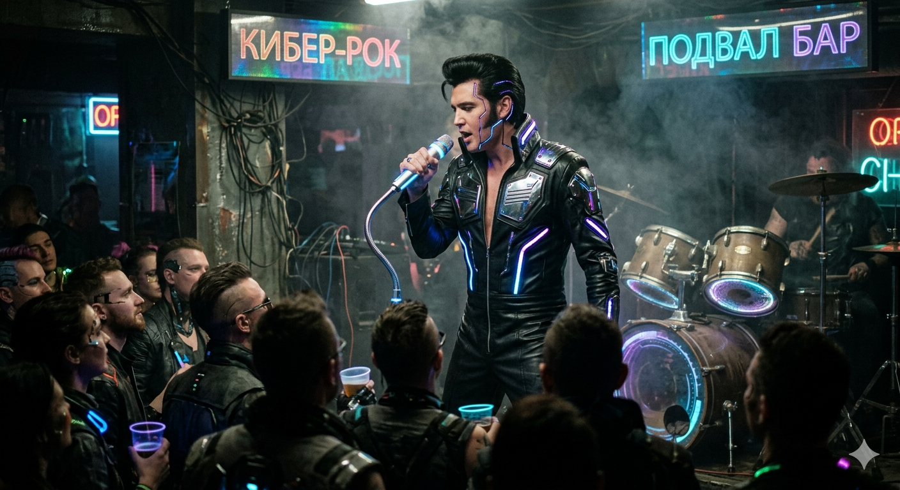

# DJ ALYX — Neural Radio Station

**Listen live:** [https://djalyx.2077911.xyz/](https://djalyx.2077911.xyz/)
**Stream For Mobile** [https://djalyx.2077911.xyz/mobile](https://djalyx.2077911.xyz/mobile)

AI-powered radio station with a neural DJ. Plays music from a local collection, generates live commentary via LLM, and voices it with neural TTS.

<details>
<summary>Нажмите, чтобы развернуть (заголовок)</summary>

- О музыке: локальная коллекция 76 Гб, IDM, DarkSynth, ChipTune. 
- Станция в разработке, любые отзывы, предложения по улучшению и даже желаемую музыку в ротацию можно и нужно отправлять на адрес stend003@yandex.ru 
- Может прерываться, зависать, внезапно выключаться, сейчас радио не в потребительском состоянии. 
- Серверы оплачены на 3 месяца, дальше будет видно. 



</details>


## Status

Development is active. The station is online but not broadcasting 24/7 yet — the schedule is being formed.

## Features

- **Neural DJ** — Alyx selects tracks, writes witty commentary via LM Studio, and voices it via F5-TTS
- **Web interface** — browser-based terminal with live logs and audio stream
- **Icecast streaming** — MP3 stream accessible to any player/browser
- **Last.fm integration** — artist bios as context for the AI (with offline fallback)

## Planned

- **Track requests** — listeners will be able to suggest songs for future rotation
- **Schedule** — fixed broadcast times
- **Server support** — if listeners appear, a donation scheme will be considered to cover hosting costs

## Quick Start

```bash
# Internet broadcasting only
python start_all.py

# With FM transmitter (HackRF on 95 MHz)
python start_all.py --fm
```

## Stack

- Python + asyncio
- F5-TTS (neural voice synthesis)
- LM Studio (local LLM for text generation)
- Django + Channels (web interface + WebSocket)
- Icecast + nginx (audio streaming)
- Icecast, nginx, Django hosted on remote server — listeners stream from there, not from the broadcaster's home connection

## Project Structure

```
dj_alyx/
├── play_music.py         # main radio orchestrator
├── ai_connector.py       # LLM speech generation
├── voice_engine.py       # TTS voice synthesis
├── last_fm.py            # artist info (with offline fallback)
├── journal_prompt_generic.py  # LLM prompts
├── start_all.py          # launcher
├── fm.py                 # GNU Radio FM transmitter (optional)
├── django-aws-terminal-websocket/  # web interface service
│   ├── vmwebsocket/      # Django project
│   └── terminal/         # WebSocket terminal + log API
├── requirements.txt
└── AGENTS.md
```

## License

MIT
